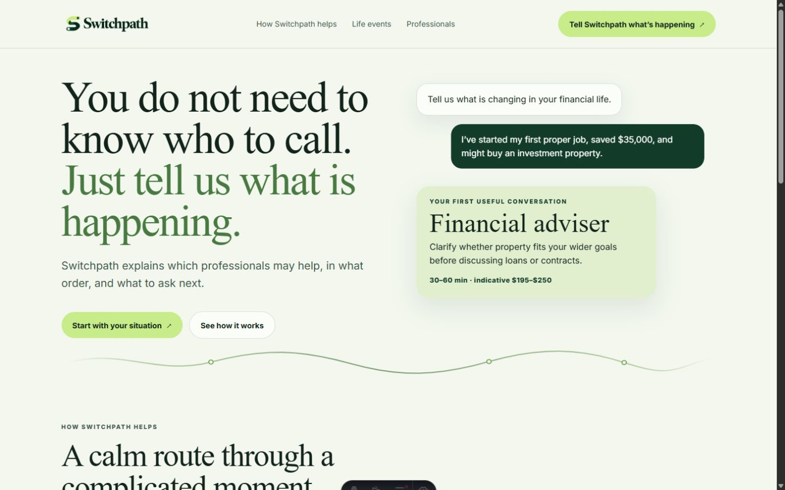
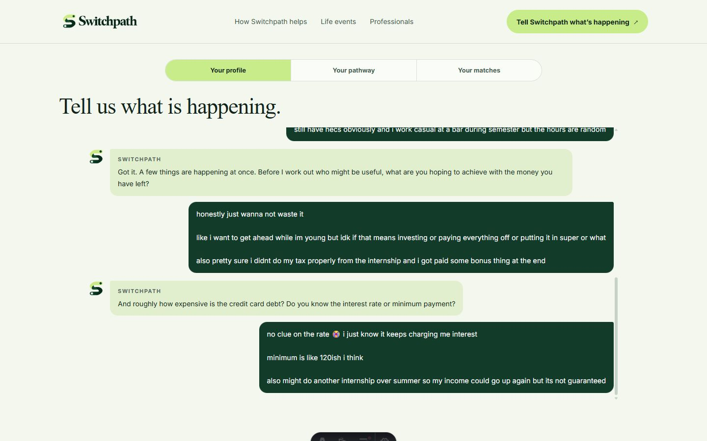
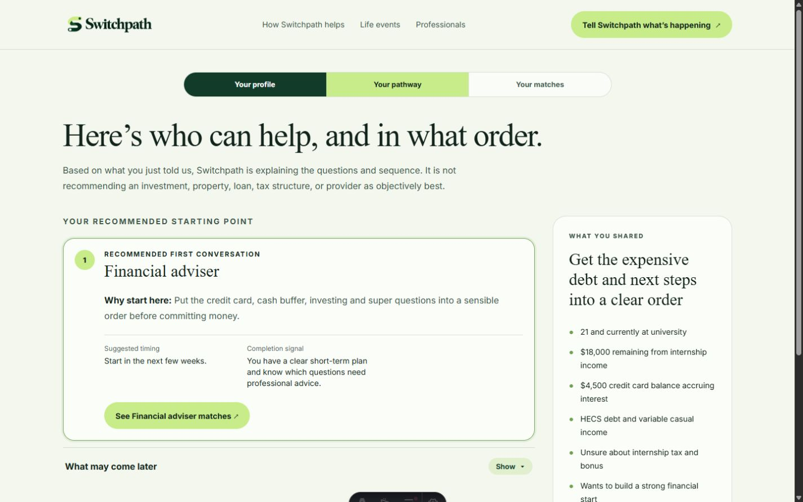
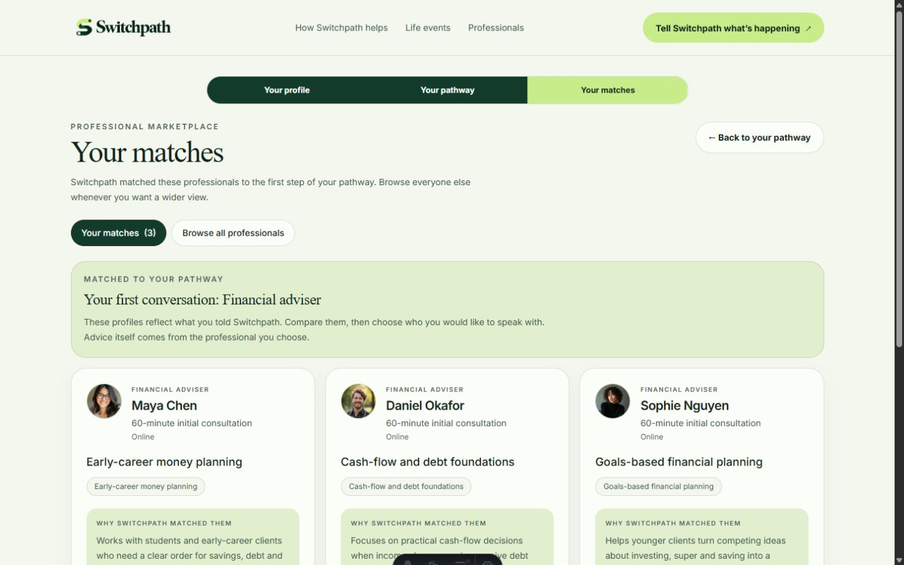

<p align="center">
  
</p>

<p align="center">
  <strong>Weekend of Startups 2026 semi-finalist</strong><br>
  A clearer first step when you do not know which financial professional to call.
</p>



## What Switchpath does

Financial decisions often begin with a life event, not a job title. You might have started earning more, taken on debt, begun thinking about property, or realised your tax situation is getting complicated. Knowing whether to call a financial adviser, mortgage broker, accountant, or lawyer is a problem of its own.

Switchpath starts with the situation. It asks a few plain-language questions, turns the answers into an ordered pathway, and explains why each professional may be useful. The user can then compare matched professionals and request a consultation.

Switchpath's promise: **you do not need to know who to call. Just tell us what is happening.**

## The demo journey

We built one complete scenario for the weekend: a university student with internship income, credit card debt, HECS, uncertain tax, and no clear idea what to do first.

### 1. Describe what is happening

The intake feels like a conversation rather than a financial form. Switchpath asks only for the details needed to work out a useful starting point.



### 2. See who can help, and in what order

The pathway separates the first useful conversation from the people who may be needed later. Each step includes a reason, suggested timing, and a clear signal for when to move on.



### 3. Compare relevant professionals

The marketplace ranks profiles against the active pathway step. Match explanations sit beside practical details such as speciality, consultation price, location, and availability.



The final interaction lets the user request a fictional consultation with one of the matched advisers.

## Built in 48 hours

Switchpath was created for Weekend of Startups 2026, where it reached the semi-finals. Claude helped us turn the initial product idea into a working demo within the weekend.

The prototype uses:

- Astro 7 and small client-side scripts
- Tailwind CSS 4
- structured AI output for summaries, pathways, and professional matches
- versioned browser storage so the journey survives navigation
- a deterministic demo mode for reliable presentations
- fictional local data for professional profiles and bookings

We kept the scope to one complete journey. Accounts, payments, calendar integrations, and credential checks were left outside the weekend build.

## Run it locally

You will need Node.js 22.12 or newer.

```bash
git clone https://github.com/johnk-UQ/26Hack.git
cd 26Hack/frontend
npm install
npm run dev:demo
```

Open [http://localhost:4321](http://localhost:4321) and follow the journey from the landing page. Demo mode is deterministic and does not require an API key.

To run the checks:

```bash
npm test
npm run build
```

## Scope and responsibility

Switchpath explains professional roles, useful questions, and a possible order for conversations. It does not provide financial, credit, tax, legal, property, or investment advice.

All professionals, availability, fees, and consultation requests shown in the demo are fictional. This is a product-experience prototype; a production financial service would need verified professionals, secure accounts, and the appropriate legal and compliance work.
